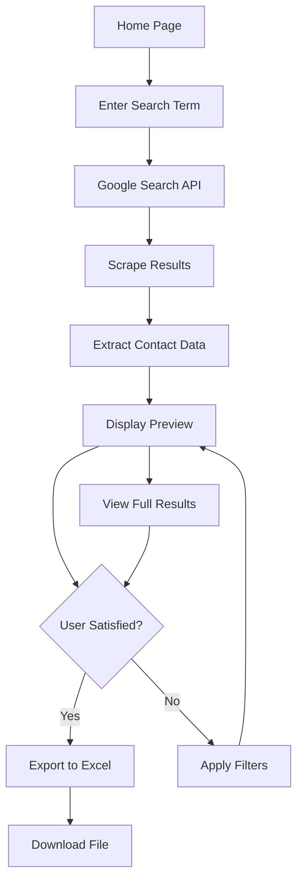

## 1. Product Overview
A web-based data scraper that searches Google for user-provided terms and extracts contact information (names, emails, company names) from search results, then exports the data to Excel format.

This tool helps sales teams, marketers, and researchers quickly build contact lists from public web data without manual searching and copying.

## 2. Core Features

### 2.1 User Roles
| Role | Registration Method | Core Permissions |
|------|---------------------|------------------|
| Free User | Email registration | 10 searches per day, 50 results per search |
| Premium User | Subscription upgrade | Unlimited searches, 500 results per search, priority processing |

### 2.2 Feature Module
The data scraper consists of the following main pages:
1. **Home page**: search input, results preview, export functionality.
2. **Results page**: detailed results table, filtering options, bulk selection.
3. **History page**: past searches, download previous exports, usage statistics.

### 2.3 Page Details
| Page Name | Module Name | Feature description |
|-----------|-------------|---------------------|
| Home page | Search Input | Enter search terms with keyword suggestions and search history dropdown. |
| Home page | Quick Preview | Display first 10 results in card format with basic contact info. |
| Home page | Export Controls | Choose Excel format, select data fields, initiate download. |
| Results page | Results Table | Paginated table showing all scraped data with sorting and filtering. |
| Results page | Data Filters | Filter by company name, email domain, or contact name. |
| Results page | Bulk Actions | Select multiple rows, delete duplicates, export selected. |
| History page | Search History | List previous searches with date, query, and result count. |
| History page | Export History | Download previous Excel files, view export metadata. |
| History page | Usage Stats | Show daily search quota usage and remaining limits. |

## 3. Core Process
User Flow:
1. User enters search term in the search box on the home page
2. System searches Google via API and scrapes result pages
3. Extracted data (names, emails, companies) is displayed in preview
4. User reviews results and applies filters if needed
5. User clicks export to generate Excel file
6. System processes data and provides download link
7. Downloaded file contains organized contact information

## 4. User Interface Design

### 4.1 Design Style
- Primary color: #2563eb (blue), Secondary color: #64748b (slate)
- Button style: Rounded corners with subtle shadows, primary buttons filled, secondary outlined
- Font: Inter family, 16px base size, 14px for secondary text
- Layout: Card-based with generous whitespace, top navigation bar
- Icons: Heroicons for consistency, minimal emoji usage

### 4.2 Page Design Overview
| Page Name | Module Name | UI Elements |
|-----------|-------------|-------------|
| Home page | Search Input | Large centered input with placeholder text, search button with icon, recent searches dropdown |
| Home page | Quick Preview | Grid of contact cards showing name, email, company, hover effects for details |
| Home page | Export Controls | Dropdown for field selection, Excel format indicator, prominent export button |
| Results page | Results Table | Clean data table with sortable columns, row hover states, action buttons per row |
| Results page | Data Filters | Collapsible filter panel with input fields, apply/clear buttons, filter badges |
| History page | Search History | Chronological list with search terms, result counts, quick actions for re-run |

### 4.3 Responsiveness
Desktop-first design with mobile adaptation. Search input and preview cards stack vertically on mobile. Table becomes horizontally scrollable with sticky headers on smaller screens.

### 4.4 3D Scene Guidance
Not applicable for this data-focused application.