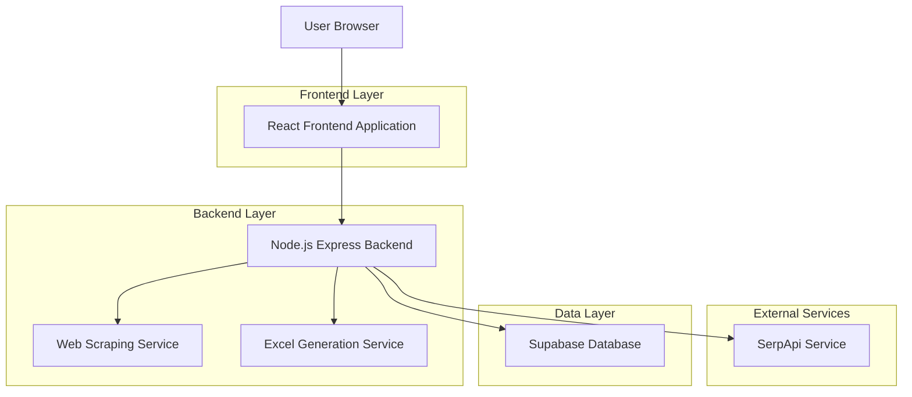
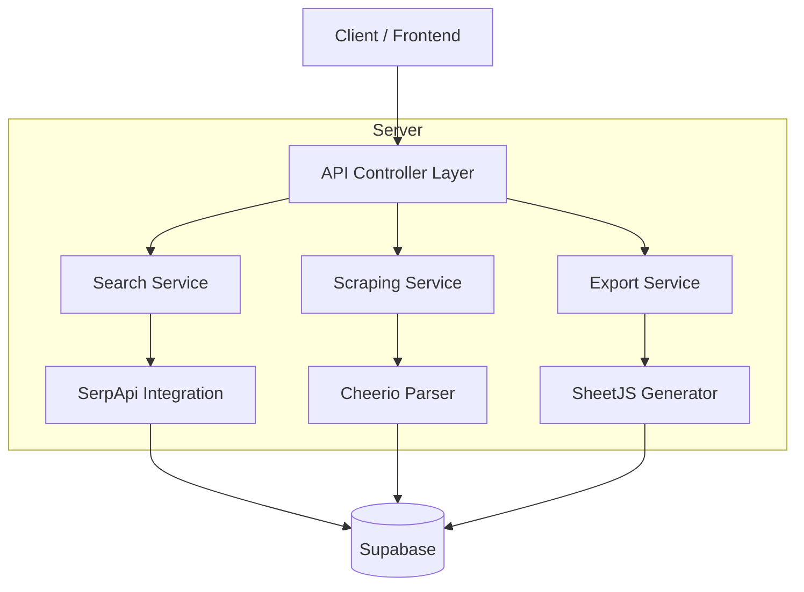
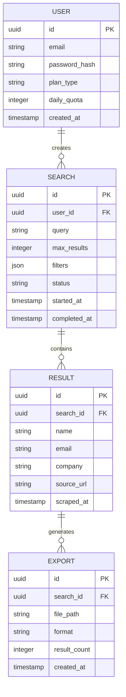

## 1. Architecture design



## 2. Technology Description
- Frontend: React@18 + tailwindcss@3 + vite
- Initialization Tool: vite-init
- Backend: Express@4 + Node.js@18
- Database: Supabase (PostgreSQL)
- External APIs: SerpApi for Google search, Cheerio for web scraping
- File Processing: SheetJS for Excel generation

## 3. Route definitions
| Route | Purpose |
|-------|---------|
| / | Home page with search interface |
| /results | Display scraped results in table format |
| /history | Show past searches and downloads |
| /api/search | Initiate new search and scraping process |
| /api/results/:id | Get paginated results for specific search |
| /api/export/:id | Generate and download Excel file |
| /api/history | Retrieve user's search history |

## 4. API definitions

### 4.1 Search API
```
POST /api/search
```

Request:
| Param Name | Param Type | isRequired | Description |
|------------|-------------|-------------|-------------|
| query | string | true | Search term for Google search |
| max_results | number | false | Maximum results to scrape (default: 50) |
| filters | object | false | Filter criteria for email domains, company names |

Response:
| Param Name | Param Type | Description |
|------------|-------------|-------------|
| search_id | string | Unique identifier for this search session |
| status | string | Processing status: pending, completed, failed |
| estimated_time | number | Estimated processing time in seconds |

Example:
```json
{
  "query": "software engineers san francisco",
  "max_results": 100,
  "filters": {
    "email_domains": ["gmail.com", "company.com"],
    "company_keywords": ["tech", "startup"]
  }
}
```

### 4.2 Results API
```
GET /api/results/:search_id?page=1&limit=50
```

Response:
| Param Name | Param Type | Description |
|------------|-------------|-------------|
| results | array | Array of scraped contact data |
| total | number | Total number of results |
| page | number | Current page number |
| has_more | boolean | Whether more results exist |

Example Result Object:
```json
{
  "id": "uuid",
  "name": "John Smith",
  "email": "john@company.com",
  "company": "Tech Corp",
  "source_url": "https://example.com/profile",
  "scraped_at": "2026-02-25T10:00:00Z"
}
```

### 4.3 Export API
```
POST /api/export/:search_id
```

Request:
| Param Name | Param Type | isRequired | Description |
|------------|-------------|-------------|-------------|
| fields | array | false | Fields to include in export (default: all) |
| format | string | false | Export format: xlsx, csv (default: xlsx) |

## 5. Server architecture diagram



## 6. Data model

### 6.1 Data model definition


### 6.2 Data Definition Language

User Table (users)
```sql
-- create table
CREATE TABLE users (
    id UUID PRIMARY KEY DEFAULT gen_random_uuid(),
    email VARCHAR(255) UNIQUE NOT NULL,
    password_hash VARCHAR(255) NOT NULL,
    plan_type VARCHAR(20) DEFAULT 'free' CHECK (plan_type IN ('free', 'premium')),
    daily_quota INTEGER DEFAULT 10,
    created_at TIMESTAMP WITH TIME ZONE DEFAULT NOW(),
    updated_at TIMESTAMP WITH TIME ZONE DEFAULT NOW()
);

-- create index
CREATE INDEX idx_users_email ON users(email);
CREATE INDEX idx_users_plan ON users(plan_type);
```

Search Table (searches)
```sql
-- create table
CREATE TABLE searches (
    id UUID PRIMARY KEY DEFAULT gen_random_uuid(),
    user_id UUID REFERENCES users(id) ON DELETE CASCADE,
    query VARCHAR(500) NOT NULL,
    max_results INTEGER DEFAULT 50,
    filters JSONB DEFAULT '{}',
    status VARCHAR(20) DEFAULT 'pending' CHECK (status IN ('pending', 'processing', 'completed', 'failed')),
    started_at TIMESTAMP WITH TIME ZONE DEFAULT NOW(),
    completed_at TIMESTAMP WITH TIME ZONE,
    created_at TIMESTAMP WITH TIME ZONE DEFAULT NOW()
);

-- create index
CREATE INDEX idx_searches_user_id ON searches(user_id);
CREATE INDEX idx_searches_status ON searches(status);
CREATE INDEX idx_searches_created_at ON searches(created_at DESC);
```

Results Table (results)
```sql
-- create table
CREATE TABLE results (
    id UUID PRIMARY KEY DEFAULT gen_random_uuid(),
    search_id UUID REFERENCES searches(id) ON DELETE CASCADE,
    name VARCHAR(255),
    email VARCHAR(255),
    company VARCHAR(255),
    source_url TEXT NOT NULL,
    scraped_at TIMESTAMP WITH TIME ZONE DEFAULT NOW(),
    created_at TIMESTAMP WITH TIME ZONE DEFAULT NOW()
);

-- create index
CREATE INDEX idx_results_search_id ON results(search_id);
CREATE INDEX idx_results_email ON results(email);
CREATE INDEX idx_results_company ON results(company);
```

Exports Table (exports)
```sql
-- create table
CREATE TABLE exports (
    id UUID PRIMARY KEY DEFAULT gen_random_uuid(),
    search_id UUID REFERENCES searches(id) ON DELETE CASCADE,
    file_path VARCHAR(500) NOT NULL,
    format VARCHAR(10) DEFAULT 'xlsx' CHECK (format IN ('xlsx', 'csv')),
    result_count INTEGER NOT NULL,
    created_at TIMESTAMP WITH TIME ZONE DEFAULT NOW()
);

-- create index
CREATE INDEX idx_exports_search_id ON exports(search_id);
CREATE INDEX idx_exports_created_at ON exports(created_at DESC);
```

-- Grant permissions
```sql
GRANT SELECT ON users TO anon;
GRANT ALL PRIVILEGES ON users TO authenticated;
GRANT SELECT ON searches TO anon;
GRANT ALL PRIVILEGES ON searches TO authenticated;
GRANT SELECT ON results TO anon;
GRANT ALL PRIVILEGES ON results TO authenticated;
GRANT SELECT ON exports TO anon;
GRANT ALL PRIVILEGES ON exports TO authenticated;
```